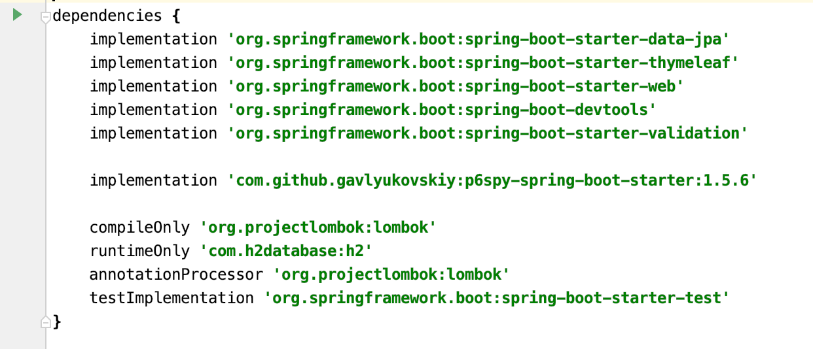
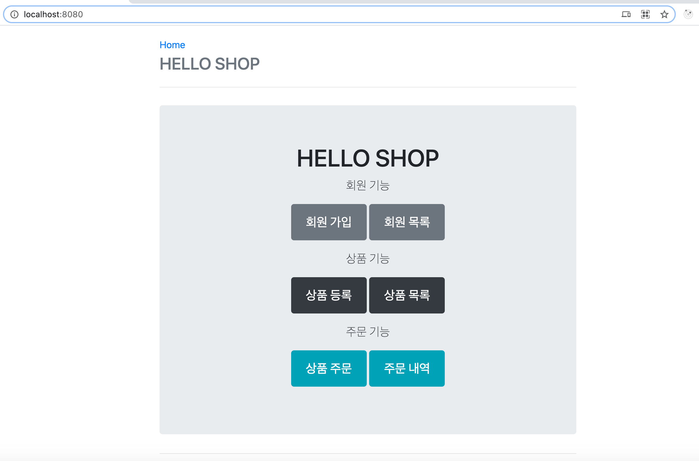
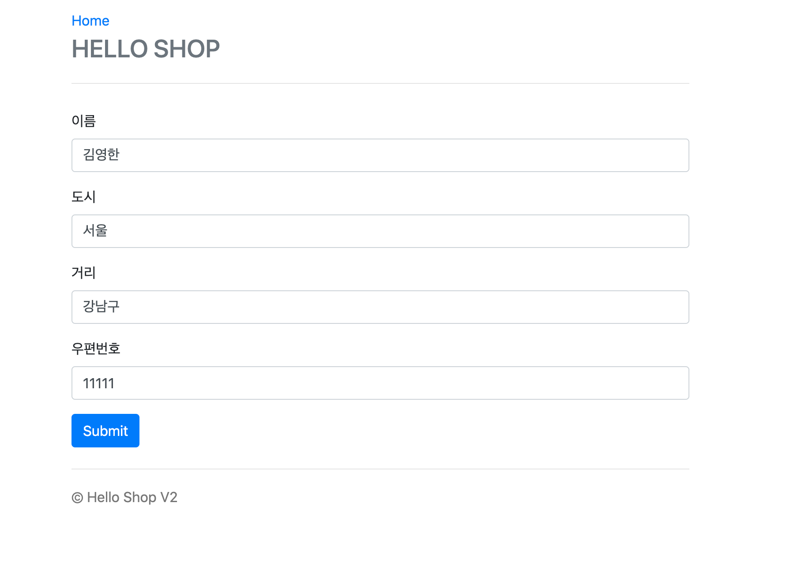
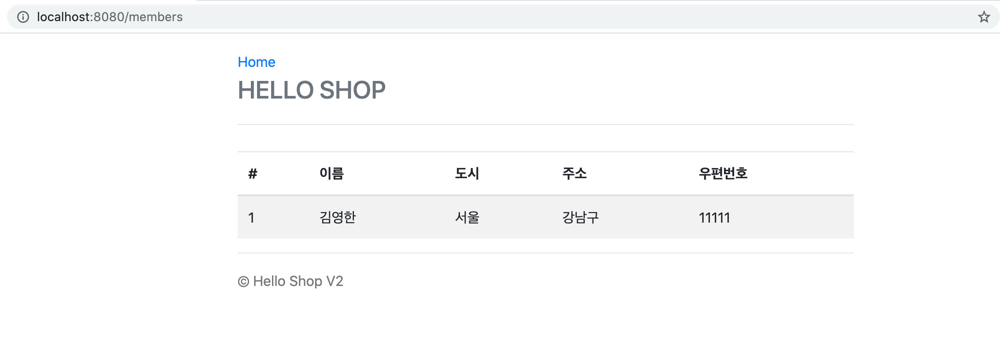
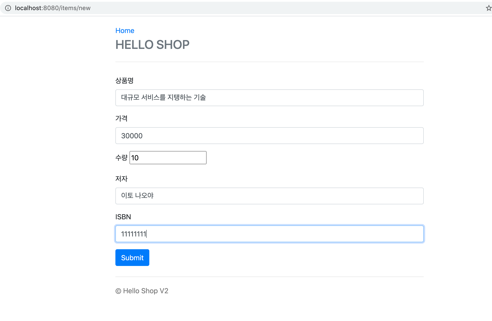
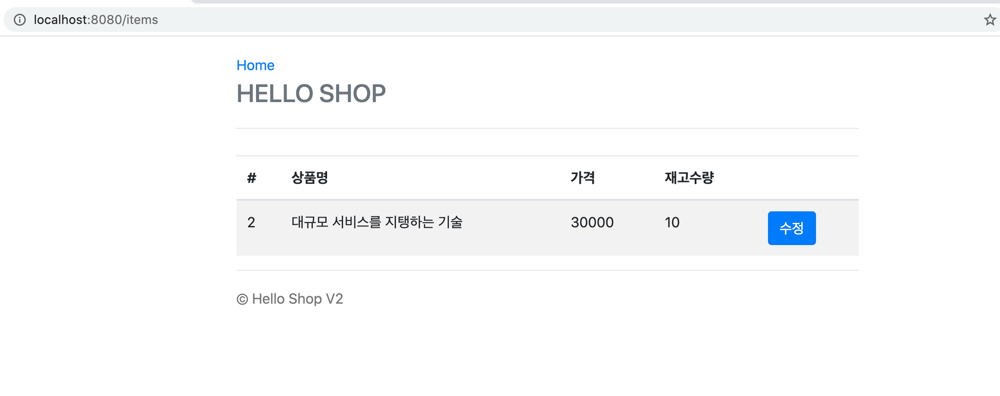
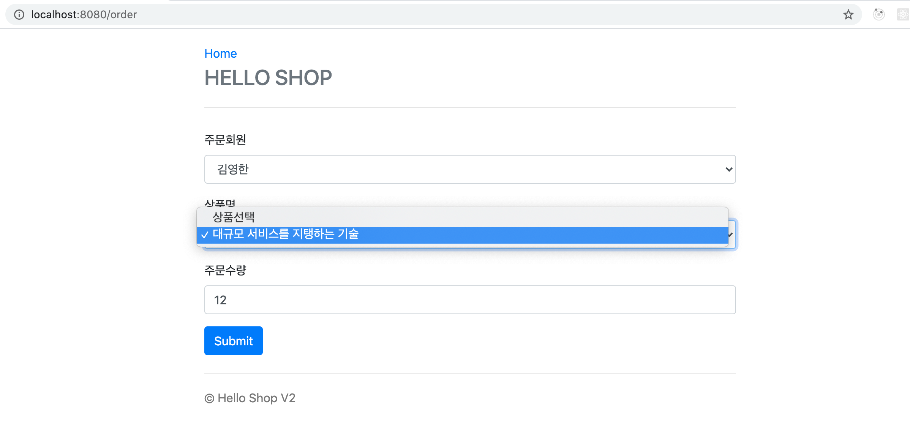

### 인프런 JPA (김영한) 강의 듣고 실전 해보기.

---

인프런 강의를 듣고 실습해본 것을 따라해보았다.
DB는 H2를 사용하였습니다.

> 김영한 - JPA책을 읽긴 했지만, 이해는 강의를 듣는것이 더 잘 되는것같다.

#### 1. 본문 

---

빌드툴은 Gradle을 사용하였습니다.
IDE는 IntelliJ를 사용하였습니다. ( 무료버전 Community 버전)

build.gradle 에는 아래와 같이 추가를 하였습니다.

#### 2. 결과 화면

----

- 메인화면

> http://localhost:8080

으로 접속하면 됩니다.

- 회원가입

이름, 주소 등으로만 이루어진 간단한 회원가입 폼

- 유저 리스트 보기

> 방금 회원 가입한 유저와 새로운 회원이 등록 될 시 확인할 화면입니다.

- 상품 등록

> 상품을 등록합니다.

- 상품 등록 목록

> 등록된 상품을 확인합니다.

- 주문해보기

> 방금 등록헀던 상품을 구매합니다.

- 주문 및 취소 목록

