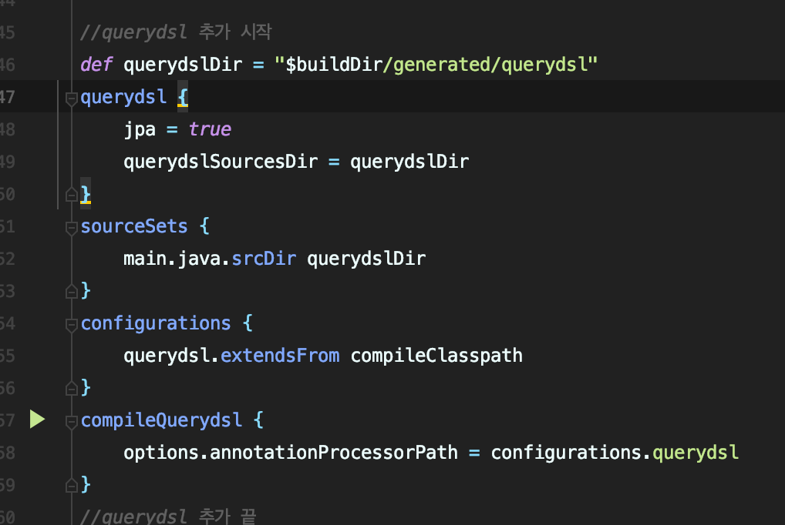
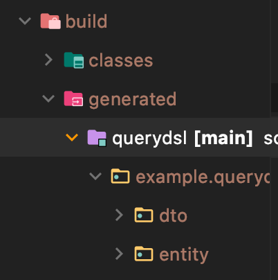
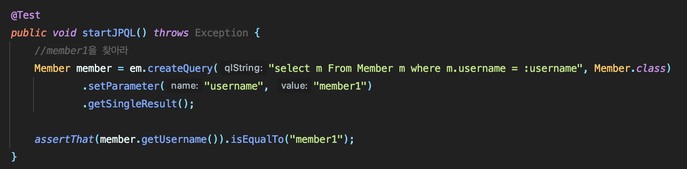
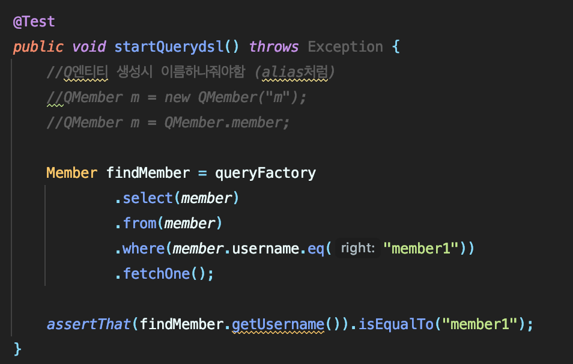

# QueryDSL
---

- querydsl를 사용하기 위한 설정

build.gradle 에서 queryDSL 의 설정을 해줘야 사용이 가능하다.

 

Compile 후, 지정된 폴더로 class 파일이 만들어진다.
> 저는 build/grenerated/querydsl 로 설정을 하였습니다.

 

- JPQL 과 QueryDSL 방식 차이

JQPL의 경우 createQuery안에 쿼리문을 적어 실행 시킨다.

하지만 QueryDSL은 메소드 안에 넣는 형식을 사용하여 직접 쿼리문을 치는 것보다 오타나 오류를 잡는데 용이하다.