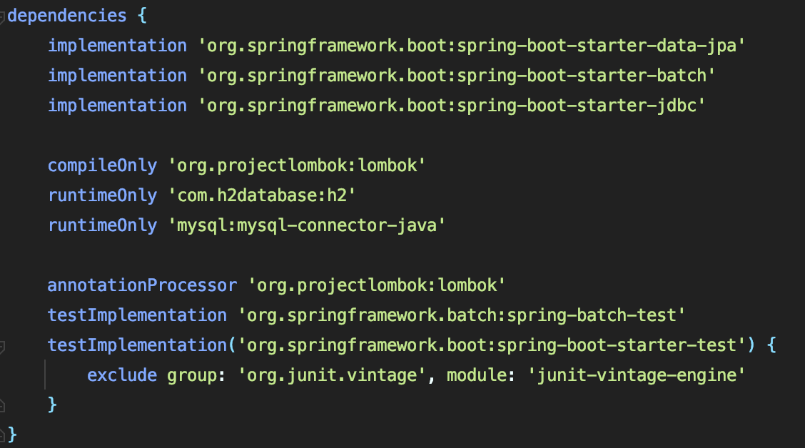
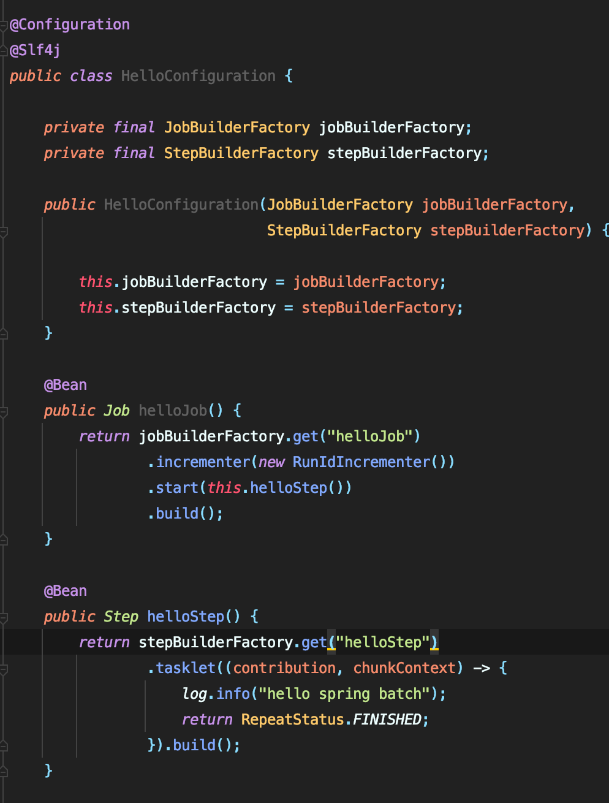
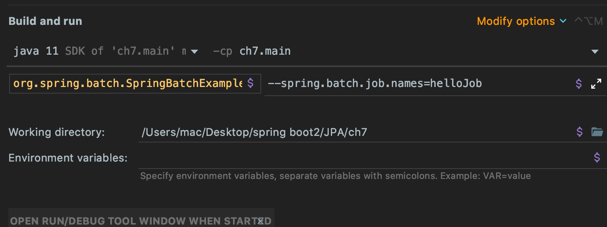
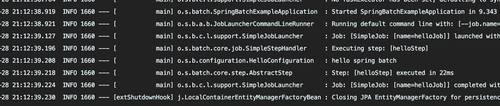
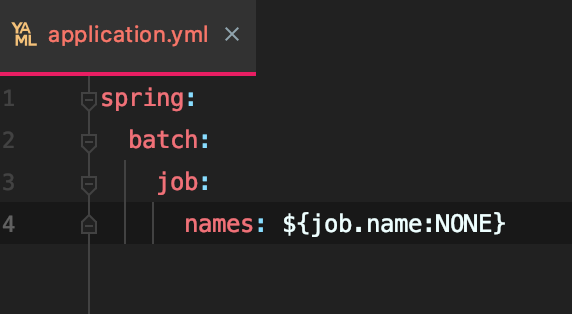
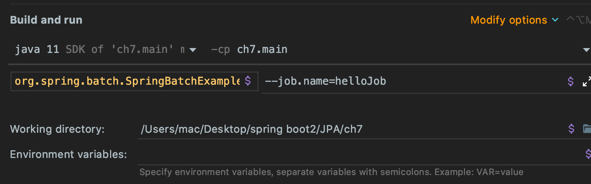
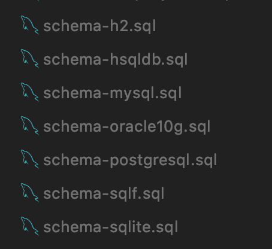
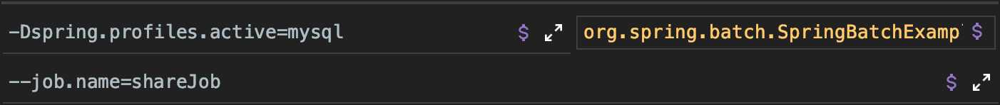
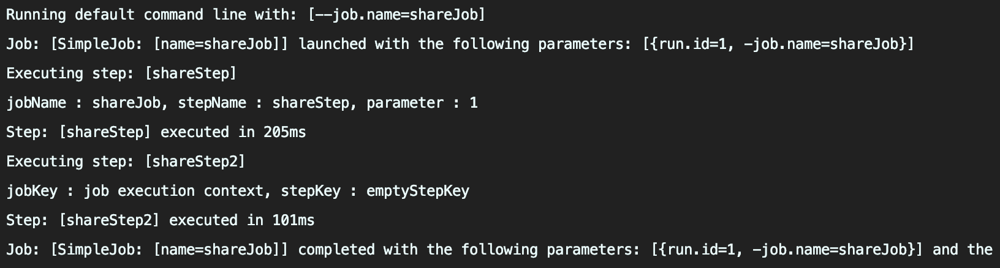

# sprinig batch

---

spring batch는 현업에서는 shell에서 crontab으로 지정후, java를 실행하거나 spring에서 @Schedule 이나 @Cron 과 같은 어노테이션을 많이 썼었다.<br>
spring boot에서는 어떻게 사용하는지 공부하기 위해 보겠습니다.



위의 사진 처럼 라이브러리를 추가해준다.<br>
처음보는 라이브러리라 하면 spring-boot-starter-batch 이다.<br>
이번 공부때 제일 중요한 라이브러리이다. 꼭 알아두자!



Configuration은 Job과 Step을 설정해준다.<br>
예를 들어 helloJob와 helloStep을 만들어 실행이 되는지 확인해보겠습니다.



java argument에 ```--spring.batch.job.names=helloJob``` 을 넣어 helloJob을 실행해 볼 수 있다.



console에 보면 hello spring batch 가 뜬것을 볼 수 있다.

- 다른 방법

application.yml 이라는 스프링부트 설정을 잡는 곳을 이용해 보겠다.



job.name을 설정하고 argument를 설정하면 더 짧게 argument을 지정할 수 있다.



실행결과는 위에 ```--spring.batch.job.names=helloJob``` 와 같은 결과가 나온다.


---

- step 두개를 연속으로 사용해보기

spring batch를 mysql에서 사용하기 위해서는 추가해야하는 몇가지 테이블들이 있다.<br>
라이브러리가 있는 곳에 spring-batch-core 부분에 이와 같이 sql관련 파일들이 몇개 보인다.



h2, mysql, oracle 등 여러가지 데이터베이스별 sql이 적혀 있으며 저는 mysql을 사용함으로 mysql의 sql문이 적혀있다.

```sql
CREATE TABLE BATCH_STEP_EXECUTION_CONTEXT  (
	STEP_EXECUTION_ID BIGINT NOT NULL PRIMARY KEY,
	SHORT_CONTEXT VARCHAR(2500) NOT NULL,
	SERIALIZED_CONTEXT TEXT ,
	constraint STEP_EXEC_CTX_FK foreign key (STEP_EXECUTION_ID)
	references BATCH_STEP_EXECUTION(STEP_EXECUTION_ID)
) ENGINE=InnoDB;

CREATE TABLE BATCH_JOB_EXECUTION_CONTEXT  (
	JOB_EXECUTION_ID BIGINT NOT NULL PRIMARY KEY,
	SHORT_CONTEXT VARCHAR(2500) NOT NULL,
	SERIALIZED_CONTEXT TEXT ,
	constraint JOB_EXEC_CTX_FK foreign key (JOB_EXECUTION_ID)
	references BATCH_JOB_EXECUTION(JOB_EXECUTION_ID)
) ENGINE=InnoDB;

CREATE TABLE BATCH_STEP_EXECUTION_SEQ (
	ID BIGINT NOT NULL,
	UNIQUE_KEY CHAR(1) NOT NULL,
	constraint UNIQUE_KEY_UN unique (UNIQUE_KEY)
) ENGINE=InnoDB;

INSERT INTO BATCH_STEP_EXECUTION_SEQ (ID, UNIQUE_KEY) select * from (select 0 as ID, '0' as UNIQUE_KEY) as tmp where not exists(select * from BATCH_STEP_EXECUTION_SEQ);

CREATE TABLE BATCH_JOB_EXECUTION_SEQ (
	ID BIGINT NOT NULL,
	UNIQUE_KEY CHAR(1) NOT NULL,
	constraint UNIQUE_KEY_UN unique (UNIQUE_KEY)
) ENGINE=InnoDB;

INSERT INTO BATCH_JOB_EXECUTION_SEQ (ID, UNIQUE_KEY) select * from (select 0 as ID, '0' as UNIQUE_KEY) as tmp where not exists(select * from BATCH_JOB_EXECUTION_SEQ);

CREATE TABLE BATCH_JOB_SEQ (
	ID BIGINT NOT NULL,
	UNIQUE_KEY CHAR(1) NOT NULL,
	constraint UNIQUE_KEY_UN unique (UNIQUE_KEY)
) ENGINE=InnoDB;

INSERT INTO BATCH_JOB_SEQ (ID, UNIQUE_KEY) select * from (select 0 as ID, '0' as UNIQUE_KEY) as tmp where not exists(select * from BATCH_JOB_SEQ);
```

step 및 job의 대한 테이블 등을 만들어주고 스프링을 실행할 때, profile로 mysql로 실행할때 설정을 다르게 하기 위해 application-mysql.yml을 만들어 사용할 수 있다.<br>
저는 인텔리제이 무료버전을 사용하므로 profile 세팅을 vm에서 설정을 한다.



step 두개를 사용해보기 위해 sharedConfiguration.java를 만들어 실행해보았다.



sharedConfiguration.java 에서 만든 것은 jobKey, stepKey를 만들어 step2에서 꺼내서 출력하는 것을 만들어 보았다.

